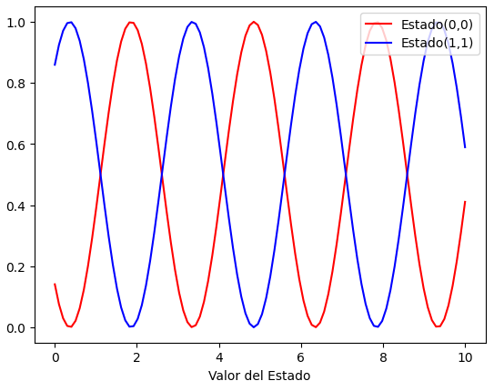

## Ejemplo

Armados con esta metodología vamos a estudiar la solución de un problema dinámico genérico.

Asumamos que queremos estudiar la evolución temporal de un estado $\mathbf{y}(t)$. Este estado será representado mediante una matriz 2x2 que corresponde a algún operador lineal. La función que genra la dinámica del problema es 
$$
f(t, \mathbf{y}) = -{\rm{i}} [\mathbf{O}, \mathbf{y}(t)],
$$
donde $\mathbf{O}$ es otro operador lineal, ${\rm{i}}$ es la constante compleja y $[A, B] = AB - BA$ es un operación de conmutación. Note que **la función $f(t, \mathbf{y})$ no depende explícitamente de la variable temporal**.

En Python, la constante compleja se denota mediante:

```python
iConst = 1.0j
```

La dinámica del problema depende intrínsicamente del operador 
. Escojamos el siguiente operador:

```python
oOper = np.array([[0, 1], [1, 0]])
```
Dicho operador puede tener distintos significados físicos dependiendo del problema dinámico en cuestión. Puede representar un mapa algebraico, el generador dinámico de un sistema caótico, un Hamiltoniano, etc.

Lo siguiente es difinir un estado inicial. De igual forma, dicho estado puede representar cantidades físicas de un sistema. Consideremos:

```python
yInit = np.array([[1, 0], [0, 0]])
```

Note que el operador $\mathbf{O}$ no es diagonal, por lo cual esperamos que conforme avanza el tiempo, dicho operador modifica el estado $\mathbf{y}(t)$.

Implementemos la función $f(t, \mathbf{y})$ en Python. Para esto puede utilizar la función [np.dot](https://numpy.org/doc/stable/reference/generated/numpy.dot.html)

```python
def dyn_generator(oper, state):
    return -1.0j*(np.dot(oper, state)-np.dot(state, oper))
```
Ahora tenemos que implementar la función que realiza la operación dinámica en `Python`. Escriba una función que implementa el método RK4:

```python
def rk4(func, oper, state, h):
    k_1 = h*func(oper, state)
    k_2 = h*func(oper + h/2, state + k_1/2)
    k_3 = h*func(oper+ h/2, state + k_2/2)
    k_4 = h*func(oper+ h, state + k_3)
    return state + (1/6)*(k_1+2*k_2+2*k_3+k_4)
```

Con estas funciones a nuestra disposición, podemos evaluar la dinámica temporal en una grilla temporal unidimensional. Utilice la función [np.linspace](https://numpy.org/doc/stable/reference/generated/numpy.linspace.html) para crear un arreglo de valores temporales:

```python
times = np.linspace(0.0, 10.0, num = 100, endpoint = True).astype(float)
```

Note que dicha función genera un arreglo con valores temporales homogéneos. Cual sería el valor de $h$?

```python
h = times[1] - times[0]
```

Ahora creamos una rutina para realizar la evolución temporal. Primero, necesitamos una copia del operador que representa el estado inicial. Esto se puede hacer con el método `copy()` del módulo `numpy`:

```python
yCopy = yInit.copy()
```

Y, finalmente, llamamos de manera iterativa la rutina `rk4()`, calculando el operador del estado del sistema $\mathbf{y}(t)$ a través del tiempo. A travéz del tiempo, vamos a guardar la entrada $(0, 0)$ y $(1, 1)$ de la matriz $\mathbf{y}(t)$. 

Para esto, vamos a inicializar dos arreglos que van a contener los valores con valores iniciales cero. Utilizamos el mismo tamaño del arreglo que contiene la variable independiente temporal: 

```python
stateQuant00 = np.zeros(times.size)
stateQuant11 = np.zeros(times.size)
```

Rutina principal: esta rutina realiza la evolución temporal.

```python
for tt in range(times.size):
   
    stateQuant00[tt] = yInit[0,0].real
    stateQuant11[tt] = yInit[1,1].real

    
    yN = rk4(dyn_generator, oOper, yInit, h)
    
   
    yInit = yN
```


Hagamos un gráfico de los resultados usando `matplotlib`:

```python
import matplotlib.pyplot as plt
plt.plot(times, stateQuant00, label='Estado(0,0)', color='red')
plt.plot(times, stateQuant11, label='Estado(1,1)', color='blue')
plt.xlabel('Tiempo')
plt.xlabel('Valor del Estado')
plt.legend(loc='upper right')
plt.show()
```

 
